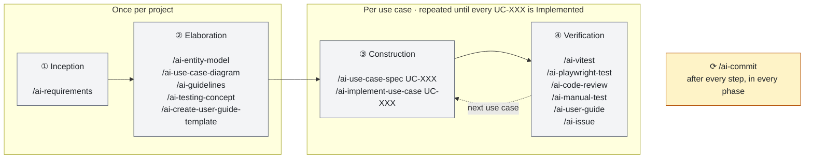
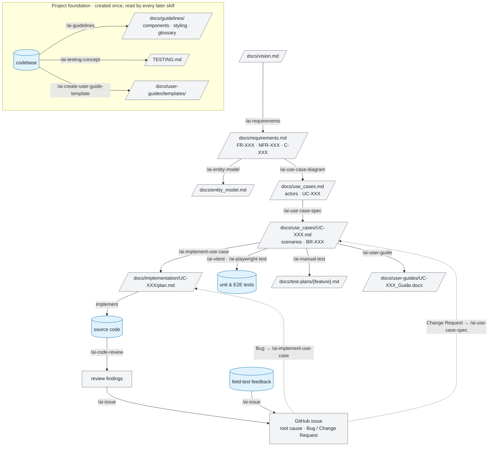
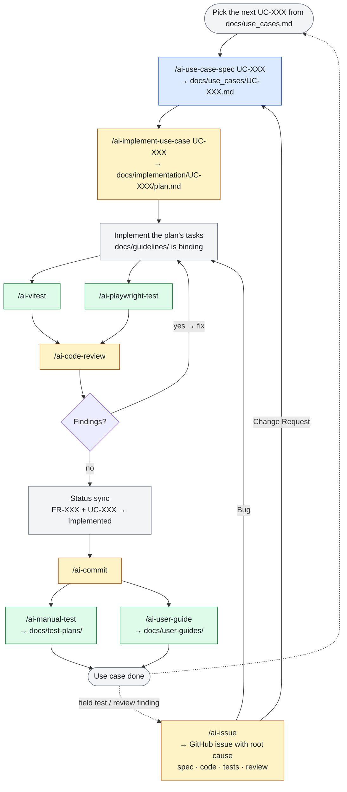

# AI Architect Marketplace

A collection of plugins that bring AI-powered requirements engineering and system modeling directly into
[Claude Code](https://code.claude.com).

## What is AI Architect?

AI Architect is a methodology plugin that keeps requirements at the center of your development process. It provides a
structured workflow from vision to specification, ensuring consistency and traceability throughout your project — from
requirements catalogs and entity models to use case diagrams and detailed specifications.

All skills follow one language rule: documentation artifacts (requirements, use cases, guidelines, test plans) are
written in your team's working language, while code artifacts — file names, identifiers, CSS classes, i18n keys,
test files — are always English. Domain terms map to English code terms through a binding glossary in
`docs/guidelines/` (see `/ai-guidelines`).

## Architecture

The marketplace contains three plugins:

- **ai-architect-core** — Requirements engineering and system modeling (requirements, entity model, use cases).
  Works with any tech stack.
- **ai-architect-testing** — Testing toolkit for React projects (project-level testing concept, Playwright E2E
  tests, Vitest unit tests including architecture/layer-boundary checks, manual test plans, end-user guides as
  Word documents with screenshots, and an interactive builder for project-specific guide templates).
- **ai-architect-dev-tools** — Developer workflow tools (conventional commits, project implementation guidelines,
  use case implementation plans, code review against project conventions, GitHub issues with root cause analysis).

Skills follow a sequential software development workflow:

|                            | Inception          | Elaboration                                               | Construction                             | Verification                                                                   |
| -------------------------- | ------------------ | --------------------------------------------------------- | ---------------------------------------- | ------------------------------------------------------------------------------ |
| **ai-architect-core**      | `/ai-requirements` | `/ai-entity-model`<br>`/ai-use-case-diagram`              | `/ai-use-case-spec`                      |                                                                                |
| **ai-architect-testing**   |                    | `/ai-testing-concept`<br>`/ai-create-user-guide-template` |                                          | `/ai-playwright-test`<br>`/ai-vitest`<br>`/ai-manual-test`<br>`/ai-user-guide` |
| **ai-architect-dev-tools** | `/ai-commit`       | `/ai-guidelines`<br>`/ai-commit`                          | `/ai-implement-use-case`<br>`/ai-commit` | `/ai-code-review`<br>`/ai-issue`<br>`/ai-commit`                               |

Each command in the table is a link in one chain — see [Development Workflow](#development-workflow) for how the
skills hand their results to each other.

## Development Workflow

The three plugins are not a loose collection of commands. They form a pipeline: every skill reads the documents
that earlier skills produced and writes exactly one artifact of its own — usually a file under `docs/`. That is
the whole principle. Requirements, model, use cases, implementation plan, tests, and guides are linked through
these files, so every line of code traces back to a requirement, and every requirement shows whether it has been
delivered.

### Phases at a glance

The workflow has two halves. The **project foundation** is built once: the requirements catalog, the entity model,
the use case overview, and the binding conventions for code and tests. After that, the team works **one use case
at a time**, repeating the same construction and verification loop until every use case is implemented.
`/ai-commit` wraps up each step in every phase with a conventional commit. Findings that surface later — from
field tests, reviews, or stakeholders — enter the loop again through `/ai-issue`, which traces each finding back
to the spec, the code, the tests, and the review before it becomes a Bug or a Change Request.



### How artifacts flow between skills

In this diagram the nodes are files and the edges are the skills that turn one file into the next. A skill's main
input is not a prompt but the document an earlier skill wrote: `/ai-requirements` starts from the team's
`docs/vision.md`, `/ai-use-case-spec` picks a use case from the diagram, and `/ai-implement-use-case` reads the
spec, the requirements, the entity model, and the guidelines to produce a plan. When a required input is missing,
the skill stops and names the skill that creates it instead of improvising.

The foundation documents on the left are written once from the codebase and then read by every later skill:
`/ai-implement-use-case` carries the rules from `docs/guidelines/` into each plan, `/ai-code-review` enforces them
on the diff, the test skills follow `TESTING.md`, and `/ai-user-guide` fills the project's own guide template.
`/ai-issue` is the only skill that reads the whole chain backwards: given a field-test finding or a review finding,
it locates the governing use case and requirements, asks which test data reproduces the problem, checks whether
the spec is silent or contradictory, and explains why the tests and the review did not catch it — the resulting
GitHub issue then points back to the artifact that has to change first.



### The use case cycle

Once the foundation exists, delivering a feature means running the cycle below for one `UC-XXX` at a time. The
implementation plan is a living document: its checkboxes are ticked off as tasks are completed, and its last task
is the **status sync** — the affected `FR-XXX` entries in `docs/requirements.md` and the use case itself move to
`Implemented` in the same change as the code, once the behavior is verified in the running app. That step is what
keeps the requirements catalog truthful, and `/ai-code-review` checks that it was not forgotten.

A use case is rarely done for good. When the field test or a later review turns up a problem, `/ai-issue` captures
it with a root cause analysis instead of a bare symptom: it decides whether the spec was wrong (Change Request —
the cycle restarts at `/ai-use-case-spec`) or the code deviates from it (Bug — the cycle restarts at the
implementation), and records why the existing tests and the review missed it, so the missing test or review rule
is added with the fix.



Colors mark the plugin a skill belongs to: blue for `ai-architect-core`, green for `ai-architect-testing`, and
amber for `ai-architect-dev-tools`.

## Installation

Using a marketplace is a two-step process: first add the marketplace catalog, then install the plugins you want.

### Step 1: Add the marketplace

From within Claude Code, run:

```shell
/plugin marketplace add https://github.com/liitu-ch/liitu-ai-architect-marketplace
```

This registers the catalog with Claude Code so you can browse what's available. No plugins are installed yet.

### Step 2: Install plugins

```shell
/plugin install ai-architect-core@liitu-ai-architect-marketplace
/plugin install ai-architect-testing@liitu-ai-architect-marketplace
/plugin install ai-architect-dev-tools@liitu-ai-architect-marketplace
```

After installing, run `/reload-plugins` to activate the plugins.

### Choose an installation scope

When installing via the interactive UI (`/plugin` > **Discover** tab), you can choose a scope:

- **User scope** (default): install for yourself across all projects
- **Project scope**: install for all collaborators on this repository (adds to `.claude/settings.json`)
- **Local scope**: install for yourself in this repository only

### Configure for your team

Team admins can set up automatic marketplace installation by adding this to `.claude/settings.json`:

```json
{
  "extraKnownMarketplaces": {
    "liitu-ai-architect-marketplace": {
      "source": {
        "source": "github",
        "repo": "liitu-ch/liitu-ai-architect-marketplace"
      }
    }
  }
}
```

When team members trust the repository folder, Claude Code prompts them to install these marketplaces and plugins.

## Available Plugins

### ai-architect-core

Stack-agnostic requirements engineering and system modeling plugin. Use this for any project, regardless of technology
stack.

#### Skills & Commands

| Command                | Skill                                 | Description                                                                                      |
| ---------------------- | ------------------------------------- | ------------------------------------------------------------------------------------------------ |
| `/ai-requirements`     | `/ai-architect-core:requirements`     | Creates requirements catalogs with functional requirements (user stories), NFRs, and constraints |
| `/ai-entity-model`     | `/ai-architect-core:entity-model`     | Creates entity models with Mermaid ER diagrams and attribute tables                              |
| `/ai-use-case-diagram` | `/ai-architect-core:use-case-diagram` | Generates Mermaid use case diagrams from requirements                                            |
| `/ai-use-case-spec`    | `/ai-architect-core:use-case-spec`    | Creates detailed use case specifications with scenarios and business rules                       |

### ai-architect-testing

Testing toolkit for React projects. Covers a project-level testing concept plus all three testing levels:
automated E2E tests, unit tests (including architecture/layer-boundary checks), and structured manual test plans.

#### Skills & Commands

| Command                          | Skill                                              | Description                                                                                               |
| -------------------------------- | -------------------------------------------------- | --------------------------------------------------------------------------------------------------------- |
| `/ai-testing-concept`            | `/ai-architect-testing:testing-concept`            | Generates a project-level `TESTING.md` documenting which test levels are used, why, and the project setup |
| `/ai-playwright-test`            | `/ai-architect-testing:playwright-test`            | Creates Playwright E2E tests for React views with accessibility-first locators and multi-device coverage  |
| `/ai-vitest`                     | `/ai-architect-testing:vitest`                     | Creates Vitest unit tests for domain logic, mappers, components, and architecture/layer-boundary checks   |
| `/ai-manual-test`                | `/ai-architect-testing:manual-test`                | Creates structured manual test plans with step-by-step test cases for device and browser testing          |
| `/ai-user-guide`                 | `/ai-architect-testing:user-guide`                 | Creates end-user guides as Word documents from use case specs, with Playwright-captured screenshots       |
| `/ai-create-user-guide-template` | `/ai-architect-testing:create-user-guide-template` | Interactively builds a project-specific user-guide/app-manual template that `/ai-user-guide` then uses    |

#### MCP Servers

| Server         | Description                                                                                          |
| -------------- | ---------------------------------------------------------------------------------------------------- |
| **playwright** | Browser automation via `@playwright/mcp` — lets Claude drive a real browser when debugging E2E tests |

### ai-architect-dev-tools

Developer workflow tools that streamline day-to-day implementation work — from documenting implementation
guidelines and planning a use case to reviewing changes against those guidelines, capturing issues with a real
root cause analysis, and crafting a conventional commit — through guided interaction.

#### Skills & Commands

| Command                  | Skill                                        | Description                                                                                                                                                                                                                         |
| ------------------------ | -------------------------------------------- | ----------------------------------------------------------------------------------------------------------------------------------------------------------------------------------------------------------------------------------- |
| `/ai-guidelines`         | `/ai-architect-dev-tools:guidelines`         | Creates a binding `docs/guidelines/` directory documenting UI component reuse, styling rules, naming & language conventions, and a domain glossary, validated against official library docs via Context7                            |
| `/ai-implement-use-case` | `/ai-architect-dev-tools:implement-use-case` | Creates a structured implementation plan for a use case with traceability, guidelines, and ordered tasks                                                                                                                            |
| `/ai-commit`             | `/ai-architect-dev-tools:commit`             | Creates conventional commits by analyzing changes, asking about type/scope, and generating messages                                                                                                                                 |
| `/ai-code-review`        | `/ai-architect-dev-tools:code-review`        | Reviews changes or a PR against project conventions (language, i18n, UI consistency, status sync) and recurring defect classes                                                                                                      |
| `/ai-issue`              | `/ai-architect-dev-tools:issue`              | Captures a GitHub issue with root cause analysis — locates the governing UC/FR/BR, checks the spec for gaps and contradictions, explains why tests and code review missed it, asks for test data, classifies Bug vs. Change Request |

#### MCP Servers

| Server       | Description                                                                                                   |
| ------------ | ------------------------------------------------------------------------------------------------------------- |
| **context7** | Library documentation lookup — used by the `guidelines` skill to validate library usage against official docs |

## Using Skills

Skills are the core building blocks of this plugin. They follow the
[Agent Skills](https://agentskills.io) open standard and are defined as `SKILL.md` files with YAML frontmatter and
markdown instructions.

### How skills work

Each skill has a **description** that tells Claude when to use it. Skills can be invoked in three ways:

- **Short slash command** — type the `/ai-*` alias (e.g., `/ai-requirements`) shipped by the plugin's
  `commands/` directory. This is the recommended way to invoke a skill explicitly.
- **Namespaced skill path** — type the fully qualified skill (e.g., `/ai-architect-core:requirements`).
- **Automatically** — Claude recognizes when a skill is relevant to your conversation and loads it on its own.

When Claude loads a skill, the skill's instructions guide how Claude approaches the task. Skill descriptions are always
in context so Claude knows what's available, but the full skill content only loads when invoked.

### Passing arguments

You can pass arguments when invoking a skill via either form. For example:

```shell
/ai-use-case-spec UC-001
/ai-architect-core:use-case-spec UC-001
```

Arguments are available to the skill via the `$ARGUMENTS` placeholder and get inserted into the skill's instructions.

### Skill structure

Each skill is a directory containing a `SKILL.md` file and optional supporting files:

```
my-skill/
├── SKILL.md           # Main instructions (required)
├── REFERENCE.md       # Reference material (optional)
├── templates/         # Templates for output (optional)
│   └── template.md
└── examples/          # Example outputs (optional)
    └── sample.md
```

The `SKILL.md` contains YAML frontmatter (between `---` markers) and markdown instructions:

```yaml
---
name: my-skill
description: What this skill does and when to use it
---
Step-by-step instructions for Claude to follow...
```

### Key frontmatter fields

| Field                      | Description                                                                                 |
| -------------------------- | ------------------------------------------------------------------------------------------- |
| `name`                     | Display name for the skill. Defaults to directory name.                                     |
| `description`              | What the skill does and when to use it. Claude uses this to decide when to apply the skill. |
| `disable-model-invocation` | Set to `true` to prevent Claude from loading this skill automatically (manual invoke only). |
| `user-invocable`           | Set to `false` to hide from the `/` menu (Claude-only background knowledge).                |
| `allowed-tools`            | Tools Claude can use without asking permission when this skill is active.                   |
| `context`                  | Set to `fork` to run in a forked subagent context.                                          |
| `agent`                    | Which subagent type to use when `context: fork` is set.                                     |

For a complete list of frontmatter fields and string substitutions, see the
[Skills documentation](https://code.claude.com/docs/en/skills#frontmatter-reference).

## Managing your installation

### Apply changes without restarting

```shell
/reload-plugins
```

### Disable, enable, or uninstall

```shell
/plugin disable ai-architect-core@liitu-ai-architect-marketplace
/plugin enable ai-architect-core@liitu-ai-architect-marketplace
/plugin uninstall ai-architect-core@liitu-ai-architect-marketplace
```

### Update the marketplace

```shell
/plugin marketplace update liitu-ai-architect-marketplace
```

## Learn More

- Visit [liitu.ch](https://liitu.ch) to learn more about the AI Architect methodology
- [Discover and install plugins](https://code.claude.com/docs/en/discover-plugins) — browse marketplaces and install
  plugins
- [Extend Claude with skills](https://code.claude.com/docs/en/skills) — skill authoring, frontmatter reference,
  and advanced patterns
- [Create plugins](https://code.claude.com/docs/en/plugins) — build your own plugins
- [Plugins reference](https://code.claude.com/docs/en/plugins-reference) — complete technical specifications
- [Create a plugin marketplace](https://code.claude.com/docs/en/plugin-marketplaces) — distribute plugins to your team

## Key Concepts

### Marketplace

A **marketplace** is a curated repository that hosts and distributes multiple Claude Code plugins. It acts as a central
hub where plugins can be discovered, installed, and managed. When you add a marketplace to Claude Code, you gain access
to all the plugins it contains. Marketplaces make it easy to share and distribute collections of related plugins.

### Plugin

A **plugin** is a self-contained extension that adds new capabilities to Claude Code. Each plugin can include:

- **Skills** - Behaviors that Claude can invoke autonomously or that users invoke as slash commands
- **Agents** - Specialized subagents for complex tasks
- **Hooks** - Event handlers that respond to Claude Code events
- **MCP Servers** - External tools and documentation sources

Plugins encapsulate everything needed to work with a particular tech stack or methodology. When enabled, a plugin's
components become available in your Claude Code session.

### Skill

A **skill** is a specialized behavior defined in a `SKILL.md` file. Skills can be invoked explicitly as slash
commands (e.g., `/ai-architect-core:requirements`) or triggered automatically by Claude when it recognizes a matching
task. Each skill can include supporting files like templates and reference documents. Skills are namespaced by their
plugin to prevent conflicts between plugins. Claude Code skills follow the
[Agent Skills](https://agentskills.io) open standard.

### MCP Server

An **MCP (Model Context Protocol) Server** is an external service that provides Claude with access to specialized tools,
documentation, and capabilities. MCP servers extend what Claude can do by connecting it to external resources like
documentation databases, APIs, and other integrations. They start automatically when the plugin is enabled.

## Security

Plugins and marketplaces are highly trusted components that can execute arbitrary code on your machine with your user
privileges. Only install plugins and add marketplaces from sources you trust.

## Troubleshooting

- **`/plugin` command not recognized**: Plugins require Claude Code version 1.0.33 or later. Run `claude --version`
  to check, and update if needed.
- **Marketplace not loading**: Verify the URL is accessible and that `.claude-plugin/marketplace.json` exists at the
  root.
- **Skill not triggering**: Check the description includes keywords users would naturally say. Try invoking directly
  with `/ai-architect-core:skill-name`. Verify the skill appears when you ask "What skills are available?"
- **Skill triggers too often**: The skill description may be too broad. Add `disable-model-invocation: true` to the
  frontmatter if you only want manual invocation.
- **Plugin skills not appearing**: Clear the cache with `rm -rf ~/.claude/plugins/cache`, restart Claude Code, and
  reinstall the plugin.
- For more troubleshooting, see the
  [official documentation](https://code.claude.com/docs/en/discover-plugins#troubleshooting).
